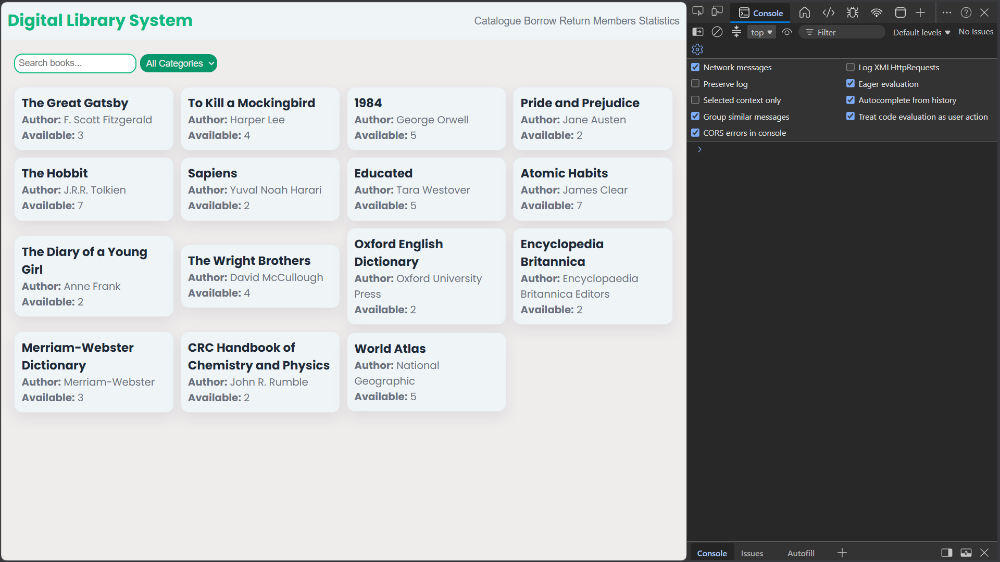
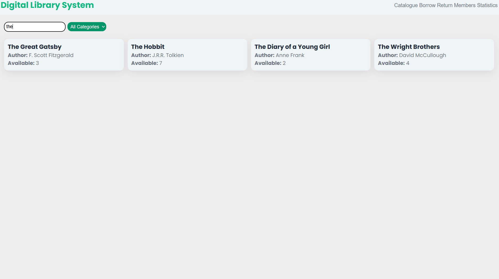
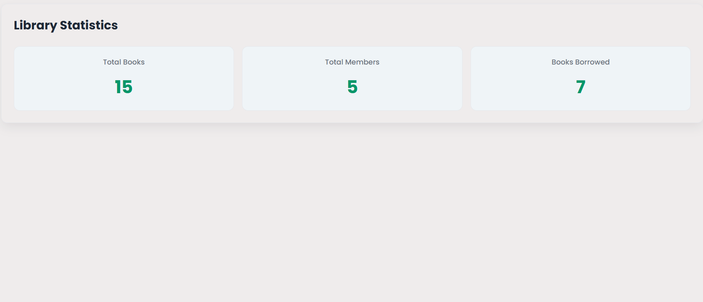
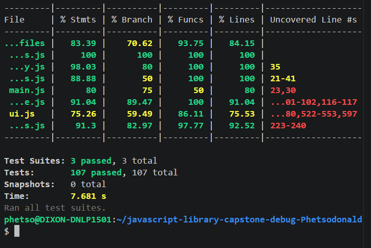
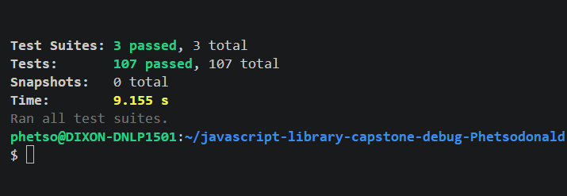
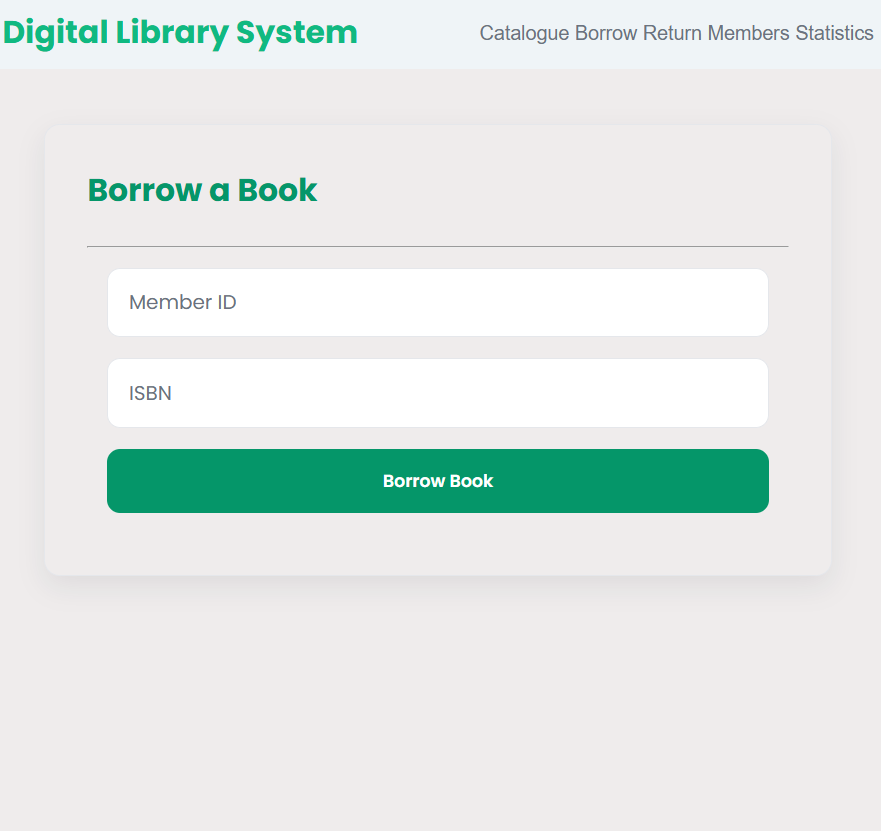
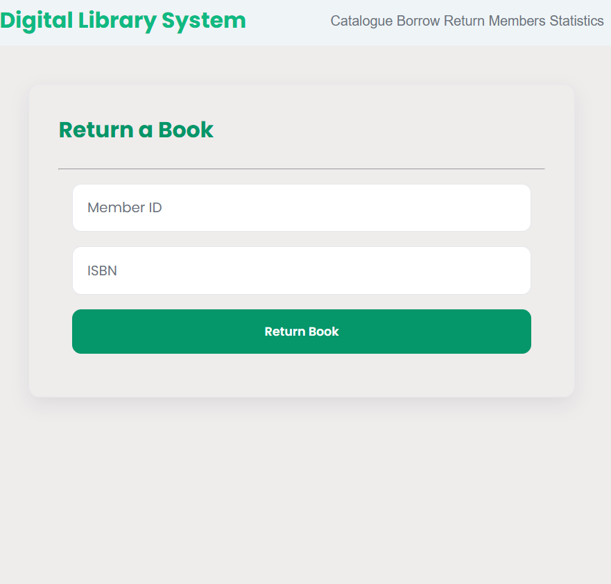
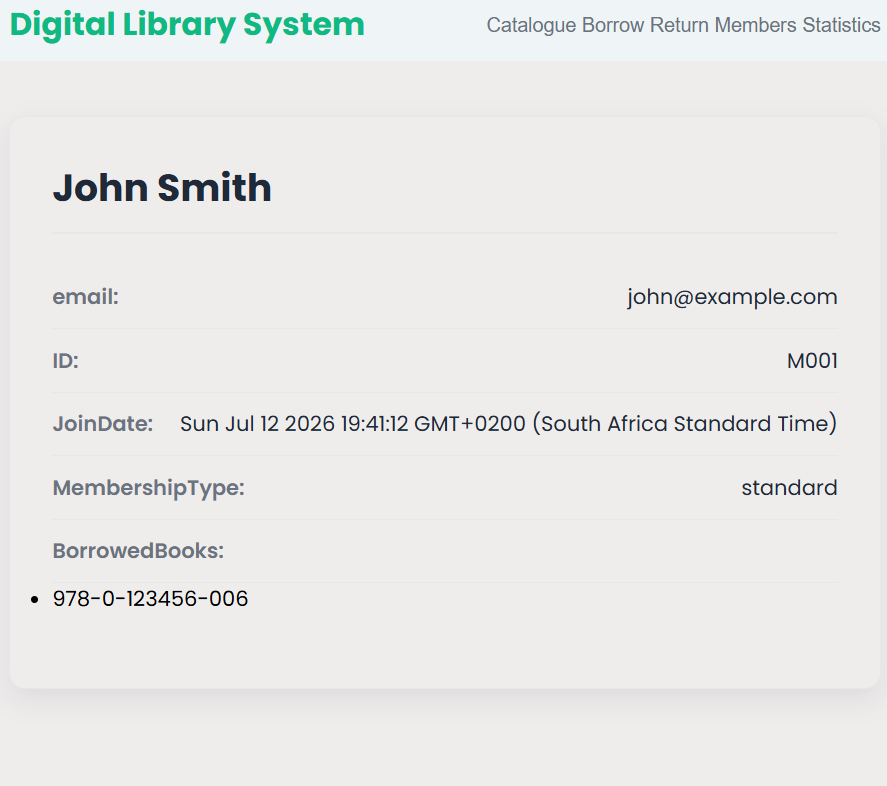
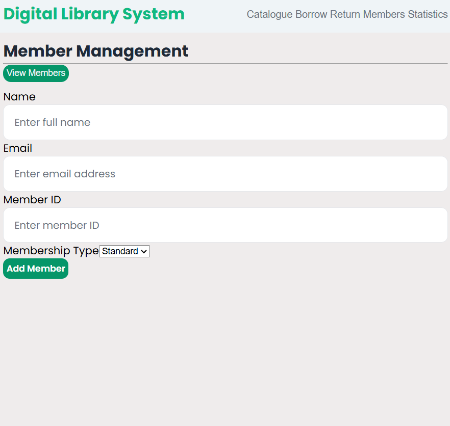
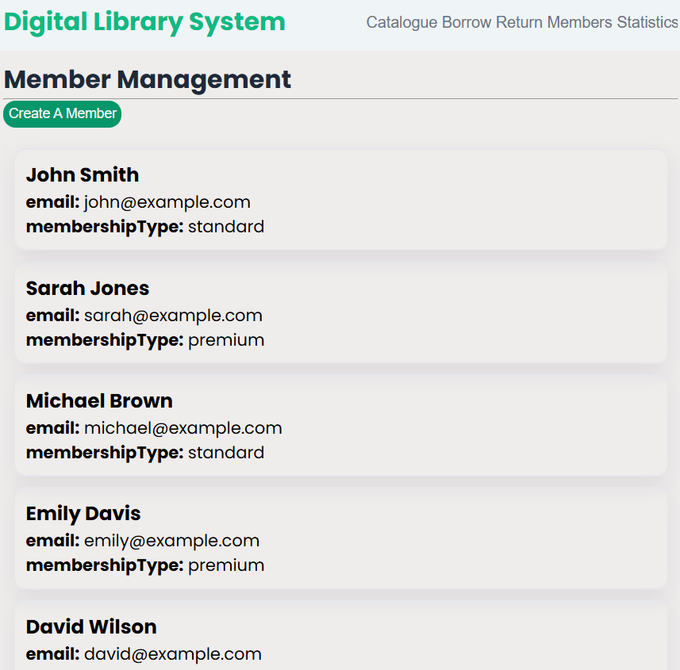

# Digital Library Management System

## System Overview

The Digital Library Management System is a JavaScript-based application designed to manage books, members, borrowing, returning, and library statistics. The system demonstrates modern JavaScript development practices including object-oriented programming, ES6+ features, DOM manipulation, local storage persistence, modular architecture, and automated testing.

The application allows users to:

- Browse and search a digital book catalogue
- Filter books by category
- View detailed book information
- Borrow and return books
- Manage standard and premium members
- Track library statistics
- Persist data using browser local storage
- Export and import library data

The system follows a modular architecture separating responsibilities into classes, storage management, utility functions, UI handling, and application initialization.

---

# Critical Errors Found

During development, multiple issues were identified and resolved.

| Severity | Error |
|---|---|
| Critical | Missing object validation caused runtime crashes |
| Critical | Book borrowing could exceed available copies |
| Critical | Member borrowing limits were not enforced |
| Critical | Data was lost after application refresh |
| Critical | LocalStorage parsing failures crashed the application |
| Critical | Duplicate members could be created |
| Critical | Duplicate books could be added |
| High | DigitalBook inheritance was incorrectly implemented |
| High | PremiumMember limits were not applied |
| High | Invalid ISBN searches caused errors |
| High | Invalid member IDs caused errors |
| High | Borrowing unavailable books was allowed |
| High | Returning books not borrowed by members was allowed |
| High | Statistics did not update automatically |
| Medium | UI sections could display simultaneously |
| Medium | Search results were not restored after clearing search |
| Medium | Missing DOM elements caused failures |
| Medium | Invalid form submissions were not handled |
| Medium | Exported data could contain inconsistent structures |
| Low | Repeated validation logic existed across files |
| Low | Code duplication existed in storage restoration |

---

# Fixes Implemented

## Validation and Error Handling

Implemented reusable validation utilities:

- `verifyString()`
- `verifyNumber()`
- `verifyObject()`
- `verifyArray()`
- `verifyMap()`

Added error handling using `try/catch` blocks for:

- LocalStorage operations
- JSON parsing
- Data importing/exporting
- Application startup

Invalid input now fails safely without breaking the application.

---

## Object-Oriented Improvements

The application was redesigned using proper class structures.

Implemented classes:

- `Book`
- `DigitalBook`
- `Member`
- `PremiumMember`

Improvements include:

- Encapsulation of book and member behaviour
- Constructor validation
- Inheritance using `extends`
- Parent initialization using `super()`
- Method overriding

Examples:

- Digital books override borrowing behaviour using downloads.
- Premium members override borrowing limits.

---

## Storage Improvements

Added persistent data management:

- Save library state to LocalStorage
- Restore books and members after refresh
- Export library data as JSON
- Import external library data

Storage operations now validate data before restoring objects.

---

## Functional Improvements

Implemented:

- Book searching
- Category filtering
- Author filtering
- Borrowing management
- Return processing
- Fine calculations
- Library statistics

Functional programming concepts are used through:

- `map()`
- `filter()`
- `reduce()`
- `find()`
- `some()`

---

# Modern ES6+ Features Added

The application uses modern JavaScript features including:

- ES6 modules (`import` / `export`)
- Classes
- Inheritance
- Template literals
- Destructuring
- Spread operators
- Rest parameters
- Arrow functions
- Default parameters
- Map collections
- Array methods

# Architecture Improvements

The application was separated into clear modules:

src/
├── library.js
├── storage.js
├── utils.js
├── ui.js
├── libraryStats.js
├── constants.js
└── main.js

## Responsibilities:

### library.js

Contains core business entities and class behaviour.

### storage.js

Handles persistence and data management.

### utils.js

Contains reusable validation and helper functions.

### ui.js

Controls DOM rendering and user interaction.

### libraryStats.js

Calculates library metrics.

### main.js

Initializes and starts the application.

This structure improves maintainability, testing, and scalability.
# User Interface Overview

## Catalogue Section

- The catalogue is the main interface for viewing and searching books.

## Borrow Section

- The Borrow section allows registered members to borrow books.

## Return Section

- The Return section processes returned books.

## Member Management Section

- This section manages library members.

## Statistics Section

- The Statistics section provides an overview of the library.

# Screenshots

The following screenshots demonstrate the main features of the Digital Library Management System.

## Working/Catalogue
- Displays the books catalogue along with Browser console.

## Search Feature
- Displays  the search feature in action.

## statistics
- Displays the library statistics

## Coverage Report
- Displays tests coverage report.

## Passing Tests
- Displays Passing tests.

## Borrow Book 
-Displays a form for a registered member to borrow a book.

## Return Book
- Displays a form for a registered member to return a book.

## Book Details
- Displays clicked book details.

## Add member
- Displays a form to create a member.

## Members list
- Displays a list of members.

## Member details
- Displays a clicked member details.

# Installation and Setup
Requirements
- Node.js installed
- npm installed

## Clone the repository:

git clone <repository-url>

## Navigate into the project:

cd javascript-library-capstone

## Install dependencies:

- npm install

# Running the Application

Start a local development server.

Example:

npx live-server

Open the displayed browser URL.

The application will load the default library data automatically.

# Running Tests

Run the complete test suite:

- npm test

Run tests with coverage:

- npm test -- --coverage

The project includes automated tests covering:

- Classes
- Utility functions
- Storage
- DOM interactions
- Borrowing and returning workflows
-  Error handling

Current test coverage exceeds the required 80% threshold.